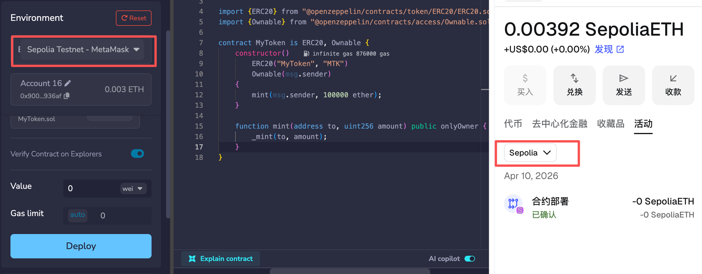

# Week 1: Web3 基础知识了解与知识检查

---

## 目录

- [1. Metamask 钱包的安装和使用](#1-metamask-钱包的安装和使用)
  - [1.1 安装与配置 Metamask](#11-安装与配置-metamask)
  - [1.2 创建钱包](#12-创建钱包)
  - [1.3 自定义添加网络](#13-自定义添加网络)
    - [1.3.1 X Layer 测试网添加](#131-x-layer-测试网添加)
    - [1.3.2 Sepolia 测试网添加](#132-sepolia-测试网添加)
  - [1.4 测试币领取](#14-测试币领取)
    - [1.4.1 X Layer 测试网](#141-x-layer-测试网)
    - [1.4.2 Sepolia 测试网](#142-sepolia-测试网)
  - [1.5 安全注意事项](#15-安全注意事项)
  - [1.6 常见问题](#16-常见问题)
- [2. 如何发币](#2-如何发币)
  - [2.1 Remix 开发代币合约](#21-remix-开发代币合约)
  - [2.2 Sepolia 测试网合约部署发币](#22-sepolia-测试网合约部署发币)
  - [2.3 交易所添加流动性，并上架](#23-交易所添加流动性并上架)
- [3. NFT发行](#3-nft发行)
  - [3.1 工具准备](#31-工具准备)
  - [3.2 NFT合约开发](#32-nft合约开发)
  - [3.3 NFT元数据准备](#33-nft元数据准备)

---

## 1. Metamask 钱包的安装和使用

### 1.1 安装与配置 Metamask

- 官网地址：[https://metamask.io/](https://metamask.io/)
- 支持平台：
  - 移动端 App
  - 浏览器插件（Chrome、Firefox 等）
- 说明：  
  例如，在 Chrome 浏览器中，访问官网后点击“Download”，选择“Install MetaMask for Chrome”即可添加插件。移动端可在 App Store 或 Google Play 搜索“MetaMask”下载安装。

---

### 1.2 创建钱包

- 步骤：
  1. 下载并安装 Metamask
  2. 创建新钱包
- 重要信息：
  - 助记词：12 个英文单词
  - 设置密码
- 说明与举例：  
  创建钱包时，系统会生成一组 12 个英文单词（如：apple banana orange ...），这就是助记词。请务必抄写并妥善保存，遗失后无法找回钱包资产。设置的密码用于本地解锁钱包。

---

### 1.3 自定义添加网络

- 应用场景：
  - 联盟链 / 私链
  - 测试链
- 需要信息：
  - 网络名称
  - RPC URL
  - Chain ID（链ID）：用于区分不同的以太坊网络。例如主网的 Chain ID 是 1，Ropsten 测试网是 3。不同网络的 Chain ID不同，防止交易在不同网络间混淆。
  - 货币符号（可选）
  - 区块浏览器 URL（可选）
- 举例说明：  
  例如，添加以太坊 Ropsten 测试网时，填写如下信息：  
  - 网络名称：Ropsten Test Network  
  - RPC URL：https://ropsten.infura.io/v3/你的API密钥  
  - Chain ID：3  
  - 货币符号：ETH  
  - 区块浏览器 URL：https://ropsten.etherscan.io  
  添加后即可在 Metamask 上切换到 Ropsten 测试网进行测试。

#### 1.3.1 X Layer 测试网添加

- 说明：  
  X Layer 测试网是 X Layer 区块链项目提供的测试环境，开发者可以在该网络上免费测试合约部署、转账等功能，不会影响主网资产。适用于 X Layer 生态的 DApp 开发和调试。

- 步骤：
  1. 打开 Metamask，点击右上角网络选择下拉菜单，选择“添加网络”。
  2. 选择“手动添加网络”。
  3. 填写以下参数：
     - 网络名称：X Layer Testnet
     - RPC URL：https://rpc-testnet.xlayer.tech
     - Chain ID：195
     - 货币符号：ETH
     - 区块浏览器 URL：https://explorer-testnet.xlayer.tech
  4. 点击“保存”，即可切换到 X Layer 测试网。

#### 1.3.2 Sepolia 测试网添加

- 说明：  
  Sepolia 测试网是以太坊官方维护的测试网络之一，主要用于开发者测试智能合约和 DApp。与主网环境一致，但使用测试币，无需真实资产，适合开发和学习阶段使用。

- 步骤：
  1. 打开 Metamask，点击右上角网络选择下拉菜单，选择“添加网络”。
  2. 选择“手动添加网络”。
  3. 填写以下参数：
     - 网络名称：Sepolia Testnet
     - RPC URL：https://rpc.sepolia.org
     - Chain ID：11155111
     - 货币符号：ETH
     - 区块浏览器 URL：https://sepolia.etherscan.io
  4. 点击“保存”，即可切换到 Sepolia 测试网。

---

### 1.4 测试币领取

#### 1.4.1 X Layer 测试网

- 切换到X Layer测试网
- 访问 [X Layer水龙头](https://web3.okx.com/zh-hans/xlayer/faucet/xlayerfaucet)
- 输入钱包地址
- 完成验证码
- 等待测试币到账

#### 1.4.2 Sepolia测试网

- 切换到Sepolia网络
- 访问 [Sepolia水龙头](https://www.alchemy.com/faucets/ethereum-sepolia)
- 连接钱包或输入地址
- 获取测试币

---

### 1.5 安全注意事项

- 助记词安全
    - 永远不要在线存储助记词
    - 不要截图或拍照保存
    - 使用硬件钱包备份
    - 不要分享给任何人
- 钓鱼网站防范
    - 只从官方渠道下载MetaMask
    - 检查网站URL是否正确
    - 不要在不信任的网站输入助记词
    - 使用硬件钱包进行大额交易
- 交易安全
    - 仔细检查接收地址
    - 设置合理的Gas费用
    - 小额测试后再进行大额交易
    - 定期备份钱包

---

### 1.6 常见问题

- 交易失败
    - 检查Gas费用是否足够
    - 确认网络连接正常
    - 检查账户余额是否充足
- 代币不显示
    - 手动添加代币合约地址
    - 检查网络是否正确
    - 刷新页面或重启扩展
- 忘记密码
    - 使用助记词重新导入钱包
    - 密码无法恢复，只能重置

---

## 2. 如何发币

### 2.1 Remix 开发代币合约

- 创建文件 MyToken.sol，填写如下代码

```solidity
// SPDX-License-Identifier: MIT
pragma solidity ^0.8.0;

import {ERC20} from "@openzeppelin/contracts/token/ERC20/ERC20.sol";
import {Ownable} from "@openzeppelin/contracts/access/Ownable.sol";

contract MyToken is ERC20, Ownable {
    constructor()
        ERC20("MyToken", "MTK")
        Ownable(msg.sender)
    {
        mint(msg.sender, 100000 ether);
    }

    function mint(address to, uint256 amount) public onlyOwner {
        _mint(to, amount);
    }
}
```

---

### 2.2 Sepolia 测试网合约部署发币

- 按照图中，切换env为sepolia测试网，并且钱包切换到sepolia测试网中，点击deploy即可（注意需要使用水龙头获取测试币，否则无法实现发币操作）
- 

---

### 2.3 交易所添加流动性并上架

- 前往 [uniswap官网](https://app.uniswap.org/)
- 在[钱包] -> [活动] 中查看部署的代币，进入交易浏览器查看代币的合约地址，你可以通过这个地址在你的钱包中添加这个代币，同时可以通过这个代币地址添加流动性
- uniswap连接钱包, 连接钱包后，点击设置，打开测试网模式
- [uniswap添加流动性](https://app.uniswap.org/positions/create?currencyA=NATIVE&currencyB=undefined&chain=ethereum_sepolia&fee=undefined&hook=undefined&priceRangeState={%22priceInverted%22:false,%22fullRange%22:false,%22initialPrice%22:%22%22,%22inputMode%22:%22price%22}&depositState={%22exactField%22:%22TOKEN0%22,%22exactAmounts%22:{}})：可以输入代币的合约地址添加流动性

---

## 3. NFT发行

### 3.1 工具准备

- [Remix](https://remix.ethereum.org/#lang=en&optimize&runs=200&evmVersion&version=soljson-v0.8.34+commit.80d5c536.js)
- [Pinata](https://pinata.cloud/): IPFS存储服务
- [OpenSea](https://opensea.io/): NFT市场

---

### 3.2 NFT合约开发

- Remix开发NFT合约：

```solidity
// SPDX-License-Identifier: MIT
// Compatible with OpenZeppelin Contracts ^5.5.0
pragma solidity ^0.8.27;

import {ERC721} from "@openzeppelin/contracts/token/ERC721/ERC721.sol";
import {ERC721URIStorage} from "@openzeppelin/contracts/token/ERC721/extensions/ERC721URIStorage.sol";
import {Ownable} from "@openzeppelin/contracts/access/Ownable.sol";

contract MyToken is ERC721, ERC721URIStorage, Ownable {
    uint256 private _nextTokenId;

    constructor(address initialOwner)
        ERC721("MyNFT", "MNFT")
        Ownable(initialOwner)
    {}

    function safeMint(address to, string memory uri)
        public
        onlyOwner
        returns (uint256)
    {
        uint256 tokenId = _nextTokenId++;
        _safeMint(to, tokenId);
        _setTokenURI(tokenId, uri);
        return tokenId;
    }

    // The following functions are overrides required by Solidity.

    function tokenURI(uint256 tokenId)
        public
        view
        override(ERC721, ERC721URIStorage)
        returns (string memory)
    {
        return super.tokenURI(tokenId);
    }

    function supportsInterface(bytes4 interfaceId)
        public
        view
        override(ERC721, ERC721URIStorage)
        returns (bool)
    {
        return super.supportsInterface(interfaceId);
    }
}
```

- 连接MetaMask到测试网
- 部署合约
- 记录合约地址 `<0xe28ef20094ce67c345f59e4298e65d30bff10648>`

---

### 3.3 NFT元数据准备

- 元数据准备

```json
{
  "name": "我的第一个NFT",
  "description": "这是一个独特的数字艺术品",
  "image": "https://gateway.pinata.cloud/ipfs/bafybeiaugjb33rmv7yoj2ug4lywhgfx2nbttexhz7hib7zqx7pp7htdqka",
  "attributes": [
    {
      "trait_type": "颜色",
      "value": "蓝色"
    },
    {
      "trait_type": "稀有度",
      "value": "稀有"
    }
  ]
}
```

- 注册 Pinata 账户
- 上传图片文件到IPFS
- 上传元数据JSON文件
- 记录IPFS哈希值
