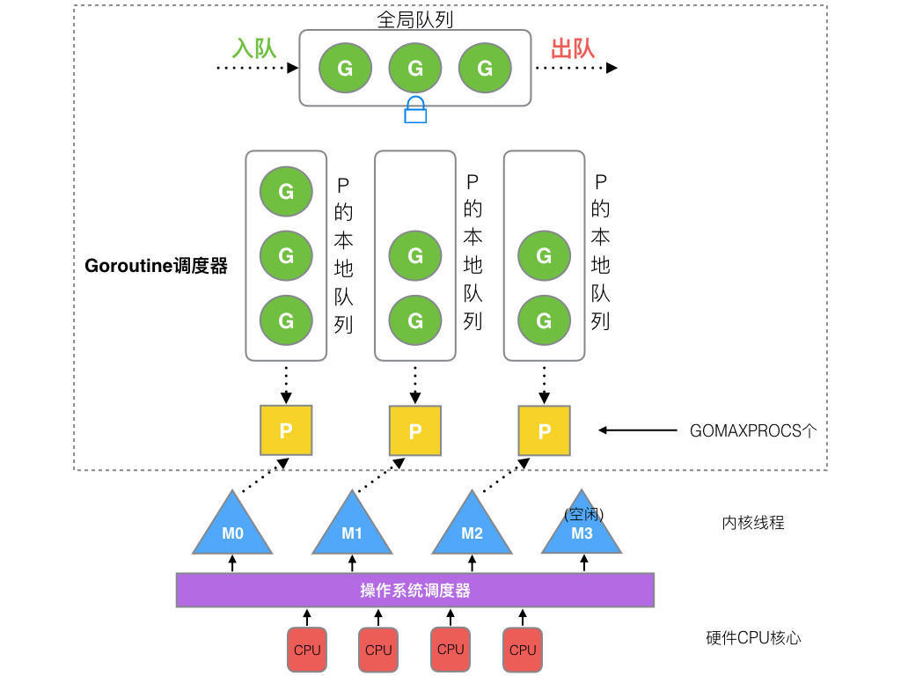

# Week 2: go语言基础学习

---

## 目录

- [1. go数据类型](#1-go数据类型)
- [2. 控制语句](#2-控制语句)
- [3. 函数](#3-函数)
  - [3.1 闭包](#31-闭包)
  - [3.2 柯里化](#32-柯里化)
- [4. 接口(interface{})](#4-接口interface)
  - [4.1 接口定义](#41-接口定义)
  - [4.2 接口实现](#42-接口实现)
  - [4.3 空类型与类型断言](#43-空类型与类型断言)
  - [4.4 多个interface{}组合](#44-多个interface组合)
- [5. goroutine/channel/select/mutex/sync/](#5-goroutinechannelselectmutexsync)
  - [5.1 goroutine](#51-goroutine)
  - [5.2 Channel](#52-channel)
  - [5.3 select](#53-select)
  - [5.4 mutex实现线程安全](#54-mutex实现线程安全)
  - [5.5 并发编程最佳实践](#55-并发编程最佳实践)
- [6. Context](#6-context)
  - [6.1 Context的类型](#61-context的类型)
  - [6.2 使用 context](#62-使用-context)
  - [6.3 Context高级使用场景](#63-context高级使用场景)
  - [6.4 Context最佳实践](#64-context最佳实践)
- [7. goroutine运行时GMP模型](#7-goroutine运行时gmp模型)
- [8. 常用标准库](#8-常用标准库)
  - [8.1 json序列化和解序列化](#81-json序列化和解序列化)
  - [8.2 文件操作](#82-文件操作)
  - [8.4 时间操作](#84-时间操作)
  - [8.5 SHA加密与MD5加密](#85-sha加密与md5加密)

---

## 1. go数据类型
- 整型：int8, int16, int32, int64, int
- 浮点型：float32, float64
- 布尔型：bool
- 字符串：string
- 数组：固定长度的元素集合，类型必须相同。
- 切片：动态长度的元素集合，类型必须相同。
- map：键值对集合，键必须唯一，值可以重复。
## 2. 控制语句
- if 语句：if 条件 { 语句 }
- switch 语句：switch 值 { case 值: 语句; break; default: 语句; }
- for 语句：for 循环条件 { 循环体 }
- 循环控制语句：break, continue
- defer 语句：defer 函数名()
## 3. 函数：
```
func 函数名(参数列表) 返回值列表 { 
    函数体 
}
```
### 3.1 闭包

闭包（Closure）是指一个函数“捕获”了其外部作用域的变量，并可以在函数体内使用这些变量。Go 语言中的闭包常用于函数作为返回值或参数时，能够记住并操作其创建时的上下文变量。

**示例：**
```go
func adder() func(int) int {
    sum := 0
    return func(x int) int {
        sum += x
        return sum
    }
}

f := adder()
fmt.Println(f(10)) // 输出 10
fmt.Println(f(20)) // 输出 30
fmt.Println(f(30)) // 输出 60
```
上例中，返回的匿名函数引用了外部变量 sum，每次调用都会累加并返回结果，这就是闭包的效果。

**执行过程与内存示意图：**

1. 调用 `adder()` 时，创建了变量 `sum`，并返回一个匿名函数，这个匿名函数持有对 `sum` 的引用。
2. 变量 `f` 保存了这个匿名函数，每次调用 `f(x)`，其实就是调用这个匿名函数，操作的都是同一个 `sum` 变量。
3. 即使 `adder()` 已经返回，`sum` 依然不会被销毁，因为闭包引用了它。

```
内存示意图：

+-------------------+         +----------------------+
|       f           | ----->  |  匿名函数(闭包)      |
+-------------------+         +----------------------+
                                   |
                                   v
                             +-----------+
                             |   sum=30  |  // sum在多次调用后累加
                             +-----------+
```

每次调用 `f(x)`，闭包内部的 `sum` 都会被更新和保留，实现了“记忆”效果。

**使用场景与举例：**

1. **数据封装与状态保持**  
   闭包可以隐藏内部状态，只暴露操作接口。例如累加器、计数器等。

   ```go
   func counter() func() int {
       count := 0
       return func() int {
           count++
           return count
       }
   }

   c := counter()
   fmt.Println(c()) // 1
   fmt.Println(c()) // 2
   ```

2. **回调函数**  
   在异步编程或事件处理中，闭包常用于保存上下文信息。

   ```go
   func process(data []int, handler func(int) int) []int {
       result := []int{}
       for _, v := range data {
           result = append(result, handler(v))
       }
       return result
   }

   factor := 2
   doubled := process([]int{1, 2, 3}, func(x int) int {
       return x * factor // handler 闭包捕获了 factor
   })
   fmt.Println(doubled) // [2 4 6]
   ```

3. **工厂函数**  
   用于生成带有自定义行为的函数。

   ```go
   func makeMultiplier(factor int) func(int) int {
       return func(x int) int {
           return x * factor
       }
   }

   double := makeMultiplier(2)
   triple := makeMultiplier(3)
   fmt.Println(double(5)) // 10
   fmt.Println(triple(5)) // 15
   ```

闭包让函数拥有“记忆”能力，适合需要保存状态或上下文的场景。
### 3.2 柯里化

柯里化（Currying）是一种将带有多个参数的函数，转换为一系列只带一个参数的函数的技术。每次调用返回一个新函数，直到所有参数都被传递，最终执行计算。柯里化常用于函数式编程，便于函数复用和组合。

**Go 语言中的柯里化示例：**
```go
func add(a int) func(int) int {
    return func(b int) int {
        return a + b
    }
}

add5 := add(5)      // 返回一个新函数，参数为b
fmt.Println(add5(3)) // 输出 8
fmt.Println(add(2)(4)) // 输出 6
```
上例中，`add` 是一个柯里化函数，先传入参数 `a`，返回一个新函数，再传入参数 `b`，最终返回 `a + b` 的结果。

**柯里化的优点：**

1. **函数复用**：柯里化使得函数的部分应用变得简单，便于创建高阶函数。
2. **延迟执行**：参数可以分多次传递，支持更灵活的调用方式。
3. **提高可读性**：通过明确的参数分离，提升代码的可读性和可维护性。

**柯里化的应用场景：**

- **函数组合**：将多个处理步骤的函数，柯里化后可以方便的组合成一个新函数。
- **事件处理**：在事件驱动的编程中，柯里化可以简化事件处理函数的参数传递。
- **配置设置**：对于需要多步配置的函数，柯里化可以让每一步的意图更加明确。

柯里化是函数式编程中的一个重要概念，通过将函数参数分解为多个单一参数的函数调用，提供了更高的灵活性和可组合性。

## 4. 接口(interface{})
在Go语言中，接口（interface）用来描述一组方法签名，任何类型只要实现了接口中声明的全部方法，就被视为满足该接口。Go不要求显式声明“implements”，这被称为隐式实现：类型的结构和功能自然地决定了它属于哪个接口。这样的设计让代码更松耦合，也便于我们在不改动已有类型的前提下，为它们赋予新的行为。
### 4.1 接口定义
```go
// 定义接口
type Shape interface {
    Area() float64
    Perimeter() float64
}
```
接口定义了一个类型，该类型必须实现接口中的所有方法。
### 4.2 接口实现
1. **结构体实现**
```go
type Rectangle struct {
    width  float64
    height float64
}
func (r Rectangle) Area() float64 {
    return r.width * r.height
}
func (r Rectangle) Perimeter() float64 {
    return 2 * (r.width + r.height)
}
```
2. **方法实现**
```go
type Circle struct {
    radius float64
}
func (c Circle) Area() float64 {
    return math.Pi * c.radius * c.radius
}
func (c Circle) Perimeter() float64 {
    return 2 * math.Pi * c.radius
}
func (c *Circle) SetRadius(radius float64) {
    c.radius = radius
}
```
3. **接口调用**
```go
func main() {
    var s Shape
    s = Rectangle{width: 3, height: 4}
    fmt.Printf("Rectangle Area: %.2f, Perimeter: %.2f\n", s.Area(), s.Perimeter())

    s = Circle{radius: 5}
    fmt.Printf("Circle Area: %.2f, Perimeter: %.2f\n", s.Area(), s.Perimeter())
}
```
代码解释: 接口Shape定义了两个方法Area()和Perimeter()，接口的实现者必须实现这两个方法。 

接口Shape的实现者可以是结构体Rectangle和结构体Circle，它们分别实现了接口Shape中的方法Area()和Perimeter()。

接口的调用通过接口变量s进行，s可以指向任何实现了Shape接口的类型实例。在main函数中，s先指向一个Rectangle实例，然后指向一个Circle实例，通过调用Area()和Perimeter()方法来计算并输出结果。

### 4.3 空类型与类型断言

```go
var i interface{}
```
这里将i定义为interface{}，即空接口。空接口可以存储任何类型的值，因此空接口可以存储任何类型的值。
- 空接口使用场景
    - fmt.Println、log.Print 等变长参数需要接受任意类型。

    - encoding/json 反序列化到 map[string]interface{}，让我们按键提取动态字段。

    - 抽象事件总线、消息队列时，可以先用空接口承载载荷，后续配合断言或注册回调处理。
- 最佳实践提醒
    - 提前约定空接口中可能出现的具体类型，配合文档或命名约束。
    - 优先考虑具体类型或泛型（Go 1.18+），空接口是兜底方案。
    - 使用类型断言或 type switch 时，一定要处理失败分支，避免 panic。
空接口（interface{}）是一种万能类型，它可以存储任何类型的值。但是，空接口的用法和具体类型有差异。
1. **类型断言**  
类型断言（Type Assertion）用于将一个接口变量转换为具体类型。
语法：
```go
var i interface{}
if v, ok := i.(T); ok {}
v := i.(T)
```
第二行代码的作用是判断i是否为T类型，如果为T类型，则返回T类型的值，并赋值给变量v，否则返回false。

这里的T是具体类型，比如int、string等。第三行代码的作用是将i转换为具体类型T，并赋值给变量v。
```go
func emptyInterfaceDemo() {
	var i interface{}
	i = 42
	// 类型断言
	v, ok := i.(int) // 类型断言，检查i是否是int类型
	if ok {
		fmt.Printf("i的值是: %d\n", v)
	} else {
		fmt.Println("i不是int类型")
	}
	// 在switch中使用i.(type)判断i的具体类型
	switch v := i.(type) {
	case int:
		fmt.Printf("i是int类型，值为: %d\n", v)
	case string:
		fmt.Printf("i是string类型，值为: %s\n", v)
	default:
		fmt.Printf("i是其他类型，值为: %v\n", v)
	}
	
}
```
### 4.4 多个interface{}组合
```go
type Reader interface {
	Read(p []byte) (n int, err error)
}
type Writer interface {
	Write(p []byte) (n int, err error)
}
type ReadWriter interface {
	Reader
	Writer
}
type File struct {
	name string
}

func (f *File) Reader(data []byte) (n int, err error) {
	return 0, nil
}
func (f *File) Write(data []byte) (n int, err error) {
	return 0, nil
}
```
## 5. goroutine/channel/select/mutex/sync/
### 5.1 goroutine
- goroutine 是 go 语言中的并发原语，它允许多个函数在相同的地址空间内并发执行。
- goroutine内部运行时，会创建一个栈，栈的容量大小由系统决定。
- goroutine 的创建和销毁由 go 运行时管理，不需要用户管理。
- goroutine也称为协线程, 协程
- 创建goroutine, 使用go关键字, 跟普通函数调用一样
- 协程调用内存示意图：

```
主线程（main goroutine）
    |
    +---> go func(i int) {...} // 子协程1
    |
    +---> go func(i int) {...} // 子协程2
    |
    +---> ...                  // 更多子协程

每个 goroutine 都有独立的栈空间，和主线程共享堆内存。
主线程通过 sync.WaitGroup 等待所有子协程完成。

+-------------------+      +-------------------+
|   主线程栈(main)  |      |   子协程栈(goroutine) |
+-------------------+      +-------------------+
           |                        |
           |                        |
           +--------共享堆内存-------+
```

- 示例代码：
```go
func sayHello() {
	fmt.Println("Hello")
}
func main() {
	// go sayHello() // goroutine调用
	// 方式1:等待执行结果，缺点无法固定每一个协程执行完成时间，sleep时间应该比协程执行时间长，所以sleep时间不好把控
	// time.Sleep(time.Second) // 主线程如果不等待将会看不到输出
	// 方式2:使用WaitGroup
	var wg sync.WaitGroup
	for i := 0; i < 10; i++ {
		wg.Add(1) // 添加一个任务
		go func(i int) {
			fmt.Println("Hello", i)
			wg.Done() // 任务完成
		}(i)
	}
	wg.Wait()
}
```
### 5.2 Channel
Channel是Go语言中用于通信的机制，Channel是Go语言中的内置类型。Channel可以传递任意类型的数据，Channel可以进行读写，也可以进行广播，也可以进行关闭。Channel可以进行阻塞，也可以进行非阻塞。

Channel主要用于协程之间的通信，比如主线程创建了10个协cheng线程，每个协cheng线程都向主线程发送消息，那么主线程就可以使用Channel进行通信，接收到消息后，就可以处理。

1. 无缓存Channel声明与使用

```go
func channelDemo() {
	fmt.Println("=== Channel示例 ===")
	// 无缓存channel
	ch := make(chan string)
	go func() {
		defer close(ch)
		ch <- "Hello"
		ch <- "World"
	}()
	time.Sleep(3000 * time.Millisecond)
	for msg := range ch {
		fmt.Println("Received:", msg)
	}
	fmt.Println("=== Channel示例结束 ===")

}
```
程序解释: 创建无缓存channel，并使用go routine发送数据，然后使用for range循环接收数据。

2. 带缓存Chanel的声明与使用

无消费者
```go
func bufferedChannelDemo() {
	ch := make(chan int, 3) // make(chan int, 3) 的缓冲区只能容纳 3 个元素；你在同一个 goroutine里连续 ch <- 1、2、3、4，第四次写入时缓冲区已经满了，又没有并发的读取方法，所以写操作会一直阻塞。由于 main goroutine 被卡住，程序到不了后面的打印语句，最终触发运行时检测到 “all goroutines are asleep – deadlock!” 的 panic。要让第 4 次写入不阻塞，必须在写入时就有其他 goroutine 去消费
	ch <- 1
	ch <- 2
	ch <- 3
	// ch <- 4
	fmt.Println("Channel写入完成，读取...")
	fmt.Println("读取:", <-ch)
	fmt.Println("读取:", <-ch)
	fmt.Println("读取:", <-ch)
	fmt.Println("=== Buffered Channel示例结束 ===")
}
```
生产消费者模式：
```go
func bufferedChannelDemoNew() {
	fmt.Println("=== 生产消费模式下的Buffered Channel示例开始 ===")
	ch := make(chan int, 3)
	defer close(ch)

	go func() {
		for v := range ch {
			fmt.Println("channel读取(R1):", v)
			time.Sleep(1000 * time.Millisecond)
		}
	}()
	go func() {
		for v := range ch {
			fmt.Println("channel读取(R2):", v)
			time.Sleep(1000 * time.Millisecond)
		}
	}()
	for i := 0; i < 50; i++ {
		fmt.Println("channel写入:", i)
		ch <- i
	}
	fmt.Println("=== 生产消费模式下的Buffered Channel示例结束 ===")

}
```
### 5.3 select
select语句用于处理多个channel，select会一直等待，直到有channel有数据可读，然后执行对应的case。

无超时的select:
```go
func selectDemo() {
	ch1 := make(chan string)
	ch2 := make(chan string)
	go func() {
		time.Sleep(1 * time.Second)
		ch1 <- "ch1"
	}()
	go func() {
		time.Sleep(1 * time.Second)
		ch2 <- "ch2"
	}()
	// 随机选择一个就绪的channel
	select {
	case v := <-ch1:
		fmt.Println("ch1:", v)
	case v := <-ch2:
		fmt.Println("ch2:", v)
	}
}
```
带超时的select:
```go
func timeoutSelectDemo() {
	ch1 := make(chan string)
	ch2 := make(chan string)
	go func() {
		time.Sleep(2 * time.Second)
		ch1 <- "ch1"
	}()
	go func() {
		time.Sleep(3 * time.Second)
		ch2 <- "ch2"
	}()
	select {
	case v := <-ch1:
		fmt.Println("ch1:", v)
	case v := <-ch2:
		fmt.Println("ch2:", v)
	case <-time.After(2 * time.Second):
		fmt.Println("timeout")
	}
}
```
select会阻塞，直到有case可以执行，如果超时，则执行case后面的代码。

循环监听多个channel

```go
func loopCheckMuilpleChannel() {
	fmt.Println("监听开始")
	ch1 := make(chan string)
	ch2 := make(chan string)
	go func() {
		for i := 0; i < 5; i++ {
			ch1 <- fmt.Sprintf("ch1: %d", i)
			time.Sleep(time.Millisecond * 100)
		}
		close(ch1)
	}()
	go func() {
		for i := 0; i < 5; i++ {
			ch2 <- fmt.Sprintf("ch2: %d", i)
			time.Sleep(time.Millisecond * 150)
		}
		close(ch2)
	}()
	for ch1 != nil || ch2 != nil {
		select {
		case v, ok := <-ch1:
			if !ok {
				ch1 = nil
				continue
			}
			fmt.Println(v)
		case v, ok := <-ch2:
			if !ok {
				ch2 = nil
				continue
			}
			fmt.Println(v)
		default:
			fmt.Println("no data")
			time.Sleep(50 * time.Millisecond)

		}
	}
	fmt.Println("监听完成")
}
```

- 带有退出信号的监听

```go
func quitSignChannelDemo() {
	jobs := make(chan int, 5)
	quit := make(chan struct{})
	go func() {
		for {
			select {
			case job := <-jobs:
				fmt.Println("处理job:", job)
			case <-quit:
				fmt.Println("收到退出信号，结束goroutine")
				return
			}
		}
	}()
	for i := 0; i < 10; i++ {
		jobs <- i
	}
	fmt.Println("发送任务完成")
	quit <- struct{}{}
	time.Sleep(100 * time.Millisecond)
	fmt.Println()
}
```
- 关闭channel后的读取
```go
func closeChannelDemo() {
	ch := make(chan int)
	close(ch)
	select {
	case v, ok := <-ch:
		fmt.Printf("val: %d, ok: %v\n", v, ok)
	default:
		fmt.Println("没有数据")
	}
	fmt.Println()
}
```
- context与channel判断timeout
```go
func contextWithChannelDemo() {
	ctx, cancel := context.WithTimeout(context.Background(), time.Second)
	defer cancel()
	ch := make(chan int)
	go func() {
		time.Sleep(time.Second * 2)
		ch <- 42
	}()
	select {
	case v := <-ch:
		fmt.Println(v)
	case <-ctx.Done():
		fmt.Println("超时:", ctx.Err())
	}
}
```
-context与channel判断cancel
```go
func contextWithCancelSentDemo() {
	ctx, cancel := context.WithCancel(context.Background())
	go func() {
		select {
		case <-ctx.Done():
			fmt.Println("超时:", ctx.Err())
			cancel()
		default:
			fmt.Println("没有超时")
			time.Sleep(time.Second * 1)
		}
	}()
	time.Sleep(time.Second * 3)
	fmt.Println("信号发送")
	cancel()
	time.Sleep(1 * time.Second)
	fmt.Println()
}
```
### 5.4 mutex实现线程安全
* 互斥锁

    sync.Mutex 是 Go 标准库 sync 包中提供的互斥锁类型，用于在多 goroutine 并发访问共享资源时实现互斥，保证同一时刻只有一个 goroutine 能访问被保护的代码区，防止数据竞争和并发安全问题。
```go      
type SafeCounter struct {
	mu    sync.Mutex
	count int
}

func (c *SafeCounter) Inc() {
	c.mu.Lock()         // 加锁，确保同一时刻只有一个 goroutine 能访问 count
	defer c.mu.Unlock() // 解锁，允许其他 goroutine 访问 count
	c.count++
}
func (c *SafeCounter) Value() int {
	c.mu.Lock()
	defer c.mu.Unlock()
	return c.count
}
```
    
    上面的这段代码实现了一个线程安全的计数器，使用 sync.Mutex 的 Lock 和 Unlock 方法来保证同一时刻只有一个 goroutine 可以访问 count 变量。

* 读写锁
```go
type ReadWriteSafe struct {
	mu   sync.RWMutex
	data map[string]int
}

func (rw *ReadWriteSafe) Read(key string) int {
	rw.mu.RLock() // 读锁，允许多个 goroutine 同时读取
	defer rw.mu.RUnlock()
	return rw.data[key]
}
func (rw *ReadWriteSafe) Write(key string, value int) {
	rw.mu.Lock() // 写锁，确保同一时刻只有一个 goroutine 写入数据
	defer rw.mu.Unlock()
	rw.data[key] = value
}
```
    上面的代码中，使用sync.RWMutex读写锁，允许多个goroutine 同时读取，但同一时刻只有一个goroutine写入数据。

* WaitGroup实现线程同步 

```go
func goroutineSync() {
	var wg sync.WaitGroup
	mu := sync.Mutex{}
	sum := 0
	for i := 0; i < 10; i++ {
		wg.Add(1)
		go func(i int) {
			mu.Lock()
			sum += i
			mu.Unlock()
			wg.Done()
		}(i)
	}
	wg.Wait()
	fmt.Println(sum)
}
```
    上面的代码中，使用sync.WaitGroup等待所有goroutine执行完毕。在每一次循环,wg.Add(1)将会添加一个计数器，wg.Done()将会减少一个计数器，wg.Wait()将会阻塞，直到所有的goroutine执行完毕。

### 5.5 并发编程最佳实践
1. 常见错误
- 没有等待goroutine
```go
go someFunc() // goroutine还没执行完，main就结束了
```
学会使用waitgroup等待goroutine执行完毕
```go
var wg sync.WaitGroup
wg.Add(1)
go func() {
    defer wg.Done()
    someFunc()
}()
```
- 闭包捕获循环变量
```go
for i := 0; i < 3; i++ {
    go func() {
        fmt.Println(i) // 可能输出都是3
    }()
}
```
正确做法
```go
for i := 0; i < 3; i++ {
    go func(_i int) {
        fmt.Println(_i) // 可能输出都是3
    }(i)
}
```
- channel未关闭
```go
go func() {
    for i := 0; i < 10; i++ {
        ch <- i
    }
    // 忘记close(ch)
}()
```
- 在goroutine中不使用recover
```go
go func() {
    panic("oops") // 会导致整个程序崩溃
}()
```
正确做法
```go
go func() {
    defer func() {
        if err:=recover(); err != nil {
            log.Println("Error: ", err)
        }    
    }()
    panic("oops") // 会导致整个程序崩溃
}()

```
2. 性能优化
- 避免频繁创建goroutine
```go
for _, item := range items {
    go func(it Item) {
        process(it)
    }(item)
}
```
在循环中频繁创建可能会造成资源浪费,可以优化为使用worker pool的方式完成操作
```go
func workerPool(items []Item, numWorkers int) {
    jobs := make(chan Item, len(items))
    
    // 启动worker
    for w := 0; w < numWorkers; w++ {
        go func() {
            for item := range jobs {
                process(item)
            }
        }()
    }
    
    // 发送任务
    for _, item := range items {
        jobs <- item
    }
    close(jobs)
    
    // 等待完成...
}
```
- 使用缓冲channel提高性能
```go
ch := make(chan int, 100) // 根据实际情况设置缓冲区大小

```
- 合理使用context超时
```go
ctx, cancel := context.WithTimeout(context.Background(), 5*time.Second)
defer cancel()
```
## 6. Context

* context.Context 是Go语言标准库中用于跨goroutine传递取消信号、超时、截止时间和请求范围值的标准方式。它是并发控制的核心工具。

    <b>核心概念：</b>

- Context在多个goroutine之间传播控制信号
- Context是不可变的，每次派生都会创建新的Context
- Context是线程安全的，可以安全地在多个goroutine中使用
- Context形成树形结构，父Context取消时，所有子Context也会被取消

    <b>主要用途：</b>

- 取消控制：取消长时间运行的操作
- 超时控制：为操作设置超时时间
- 截止时间：设置操作必须完成的最后期限
- 传递值：在请求范围内传递元数据（如trace ID、用户ID等）

### 6.1 Context的类型
Go提供了几种创建Context的方法：
* context.Background()
根Context，通常用于main函数、初始化或测试中。它永远不会被取消、没有值、没有截止时间。
```go
func main() {
    ctx := context.Background()
    // 作为根context使用
}
```
* context.TODO()
当不确定使用哪个Context时使用，通常是占位符，表示"稍后会替换成真正的Context"。
```go
func someFunction() {
    ctx := context.TODO()  // 待完善
    // ...
}
```
* context.WithCancel(parent)

创建可取消的Context，返回Context和cancel函数。调用cancel函数会取消该Context及其所有子Context。
```go
ctx, cancel := context.WithCancel(context.Background())
defer cancel()  // 确保释放资源
```
* context.WithTimeout(parent, timeout)

创建有超时时间的Context，超时后自动取消。等价于WithDeadline(parent, time.Now().Add(timeout))。
```go
ctx, cancel := context.WithTimeout(context.Background(), 5*time.Second)
defer cancel()  // 即使未超时也应该调用，释放资源
```
* context.WithDeadline(parent, deadline)
```go
deadline := time.Now().Add(10 * time.Second)
ctx, cancel := context.WithDeadline(context.Background(), deadline)
defer cancel()
```
* context.WithValue(parent, key, value)

创建携带键值对的Context，用于传递请求范围的数据。不要滥用！

```go
type contextKey string
const userIDKey contextKey = "userID"

ctx := context.WithValue(context.Background(), userIDKey, "user123")
```
假设你在 web 服务中，每个请求都需要携带用户ID，方便后续的日志、鉴权等操作：
```go
type contextKey string
const userIDKey contextKey = "userID"

func handler(ctx context.Context) {
    // 从 context 中获取 userID
    userID, ok := ctx.Value(userIDKey).(string)
    if ok {
        fmt.Println("当前用户ID:", userID)
    } else {
        fmt.Println("未获取到用户ID")
    }
}

func main() {
    // 创建带有 userID 的 context
    ctx := context.WithValue(context.Background(), userIDKey, "user123")
    handler(ctx)
}
```
在这个例子中，我们定义了一个 contextKey 类型和一个 userIDKey 常量。userIDKey 是一个 contextKey 类型的变量，用于存储用户ID。handler 函数接收一个 context 参数，从该 context 中获取 userID。main 函数创建了一个带有 userID 的 context，并传递给 handler 函数。

### 6.2 使用 context
1. 取消控制示例
```go
func cancelableDemo() {
	ctx, cancel := context.WithCancel(context.Background())
	defer cancel()
	go func() {
		for {
			select {
			case <-ctx.Done():
				fmt.Println("Goroutine收到取消信号:", ctx.Err())
				return
			default:
				fmt.Println("没有取消")
				time.Sleep(time.Second * 1)
			}
		}
	}()
	time.Sleep(time.Second * 2)
	fmt.Println("发送取消信号(等待两秒)")
	cancel()
	time.Sleep(time.Second * 2)
}
```
2. 超时控制示例
```go
func timeoutDemo() {
	ctx, cancel := context.WithTimeout(context.Background(), time.Second*3)
	defer cancel()
	go func() {
		for {
			select {
			case <-ctx.Done():
				fmt.Println("Goroutine收到取消信号:", ctx.Err())
				return
			default:
				fmt.Println("没有取消")
				time.Sleep(time.Second * 1)
			}
		}
	}()
	time.Sleep(time.Second * 5)
	fmt.Println("主函数结束")
	time.Sleep(time.Second * 2)
	fmt.Println()
}
```
3. 截止时间示例
```go
func deadlineContextDemo() {
	fmt.Println("=== 截止时间Context ===")

	// 设置3秒后的截止时间
	deadline := time.Now().Add(3 * time.Second)
	ctx, cancel := context.WithDeadline(context.Background(), deadline)
	defer cancel()

	// 检查剩余时间
	if d, ok := ctx.Deadline(); ok {
		fmt.Printf("截止时间: %v, 剩余: %v\n", d, time.Until(d))
	}

	// 等待超过截止时间
	time.Sleep(4 * time.Second)

	select {
	case <-ctx.Done():
		fmt.Println("已超过截止时间:", ctx.Err())
	default:
		fmt.Println("未超时")
	}
}
```
4. Context 传递值
```go
func valueContextDemo() {
	ctx := context.Background()
	ctx = context.WithValue(ctx, "name", "zhangsan")
	ctx = context.WithValue(ctx, "age", 50)
	precessValueRequest(ctx)
}
func precessValueRequest(ctx context.Context) {
	if name := ctx.Value("name"); name != nil {
		fmt.Println("name:", name)
	}
	if age := ctx.Value("age"); age != nil {
		fmt.Println("age:", age)
	}
}
```
### 6.3 Context高级使用场景
1. 级联取消（父取消，子也取消）
```go
func cascadeCancelDemo() {
	parentCtx, parentCanel := context.WithCancel(context.Background())
	defer parentCanel()
	childCtx1, childCanel1 := context.WithCancel(parentCtx)
	defer childCanel1()
	childCtx2, childCanel2 := context.WithCancel(parentCtx)
	defer childCanel2()

	go worker(childCtx1, "child1")
	go worker(childCtx2, "child2")

	time.Sleep(3 * time.Second)
	fmt.Println("父Context发送取消信号")
	parentCanel()
	time.Sleep(2 * time.Second)

}
func worker(ctx context.Context, name string) {
	for {
		select {
		case <-ctx.Done():
			fmt.Println("取消操作:", name, ":", ctx.Err())
			return
		default:
			fmt.Println("正在处理:", name)
			time.Sleep(time.Second)
		}
	}
}
```
2. HTTP请求超时控制
```go
func httpRequestDemo() {
	ctx, cannel := context.WithTimeout(context.Background(), time.Second*2)
	defer cannel()

	req, err := http.NewRequestWithContext(ctx, "GET", "https://www.google.com", nil)
	if err != nil {
		fmt.Println("创建请求失败:", err)
		return
	}
	client := http.Client{}
	resp, err := client.Do(req)
	if err != nil {
		if ctx.Err() == context.DeadlineExceeded {
			fmt.Println("请求超时:", err)
			return
		} else {
			fmt.Println("请求失败:", err)
		}
	}
	resp.Body.Close()
	fmt.Println("请求成功")
}
```
3. 数据库查询超时
```go
func databaseQueryDemo(db *sql.DB) {
	// 创建3秒超时的context
	ctx, cancel := context.WithTimeout(context.Background(), 3*time.Second)
	defer cancel()
	
	// 执行查询
	rows, err := db.QueryContext(ctx, "SELECT * FROM users WHERE active = ?", true)
	if err != nil {
		if ctx.Err() == context.DeadlineExceeded {
			fmt.Println("数据库查询超时")
		} else {
			fmt.Println("查询失败:", err)
		}
		return
	}
	defer rows.Close()
	
	// 处理结果
	for rows.Next() {
		// ...
	}
}
```

4. 多个goroutine协同工作
```go
func multiWorkerDemo() {
	ctx, cannel := context.WithCancel(context.Background())
	defer cannel()
	var wg sync.WaitGroup
	for i := 0; i < 5; i++ {
		wg.Add(1)
		go func() {
			defer wg.Done()
			for {
				select {
				case <-ctx.Done():
					fmt.Println("Worker收到取消信号:", ctx.Err())
					return
				default:
					fmt.Println("Worker正在工作")
					time.Sleep(time.Millisecond * 500)
				}
			}
		}()
	}
	time.Sleep(time.Second * 3)
	fmt.Println("取消所有Worker")
	cannel()
	wg.Wait()
	fmt.Println("所有Worker已取消")
}
```
5. Context在Pipeline中的应用
```go
func pipelineDemo() {
	fmt.Println("=== Pipeline示例 ===")
	
	ctx, cancel := context.WithTimeout(context.Background(), 3*time.Second)
	defer cancel()
	
	// Stage 1: 生成数据
	dataCh := generateData(ctx)
	
	// Stage 2: 处理数据
	processedCh := processData(ctx, dataCh)
	
	// Stage 3: 输出结果
	for result := range processedCh {
		fmt.Println("最终结果:", result)
	}
	
	fmt.Println("Pipeline完成")
}

func generateData(ctx context.Context) <-chan int {
	ch := make(chan int)
	go func() {
		defer close(ch)
		for i := 0; i < 10; i++ {
			select {
			case <-ctx.Done():
				fmt.Println("生成器: 收到取消信号")
				return
			case ch <- i:
				fmt.Println("生成器: 生成", i)
				time.Sleep(300 * time.Millisecond)
			}
		}
	}()
	return ch
}

func processData(ctx context.Context, input <-chan int) <-chan int {
	ch := make(chan int)
	go func() {
		defer close(ch)
		for data := range input {
			select {
			case <-ctx.Done():
				fmt.Println("处理器: 收到取消信号")
				return
			case ch <- data * 2:
				fmt.Println("处理器: 处理", data, "->", data*2)
			}
		}
	}()
	return ch
}
```
### 6.4 Context最佳实践
1. 传递参数时将Context作为第一个参数传递
2. 不要把Context放在struct中
3. 不要存储Context
4. 不要传递nil Context，如果不确定用什么context，使用context.TODO()，或者使用context.Background()
5. Context.Value使用原则
    - 只用于传递请求范围的数据，不要用于传递可选参数。
6. 适合使用Context.Value的场景：
    - Request ID（请求追踪）
    - User ID（用户认证）
    - Trace ID（分布式追踪）
    - Request-scoped metadata
7. 不适合使用Context.Value的场景：
    - 函数的可选参数
    - 配置信息
    - 依赖注入
8. 总是调用cancel函数，使用defer确保cancel被调用

## 7. goroutine运行时GMP模型
Go 运行时采用 [G-M-P（Goroutine、Machine、Processor）](https://go.cyub.vip/gmp/gmp-model/)调度模型 支撑高并发。三者职责分别是：

- G（Goroutine）：用户级协程，包含栈、状态等上下文，是被调度的基本单元。
- M（Machine）：映射到操作系统线程，用于真正执行 G。
- P（Processor）：逻辑处理器，持有可运行 G 的本地队列，并维护内存分配缓存。
只有当 G 绑定到 P，再由拥有该 P 的某个 M 执行时，协程才会真正运行，形成 G → P → M 的执行链路。


调度关键机制
- 本地队列优先：M 首先从自身绑定的 P 的本地队列中取 G，避免全局锁。
- Work Stealing：本地队列为空时，M 会从其他 P 窃取一半就绪 G，保证均衡。
- 全局队列兜底：全局可运行队列确保没有 P 被饿死。
- 自旋复用线程：没有可运行 G 时，M 会短暂自旋等待，减少频繁创建/销毁线程。
- Hand Off 机制：当 G 因系统调用阻塞，P 会解绑并交给其他空闲 M，维持整体吞吐。

## 8. 常用标准库
### 8.1 json序列化和解序列化
```go
type Person struct {
	Age  int    `json:"age"`
	Name string `json:"name"`
}

func jsonDemo() {
	p := Person{
		Age:  18,
		Name: "Tom",
	}
	data, _ := json.Marshal(p)
	fmt.Println(string(data))
	p2 := Person{}
	json.Unmarshal(data, &p2)
	fmt.Printf("%+v\n", p2)
}

```
### 8.2 文件操作
```go
func fileDemo() {
    // 读取文件
    data, err := ioutil.ReadFile("file.txt")
    if err != nil {
        panic(err)
    }
    fmt.Println(string(data))
    
    // 写入文件
    err = ioutil.WriteFile("output.txt", []byte("Hello"), 0644)
    if err != nil {
        panic(err)
    }
}
```
### 8.4 时间操作
```go
func timeDemo() {
    now := time.Now()
    fmt.Println("当前时间:", now)
    fmt.Println("格式化:", now.Format("2006-01-02 15:04:05"))
    
    // 解析时间
    t, _ := time.Parse("2006-01-02", "2024-01-01")
    fmt.Println("解析的时间:", t)
    
    // 计算时间差
    duration := time.Now().Sub(t)
    fmt.Println("时间差:", duration)
}
```
### 8.5 SHA加密与MD5加密
```go
func hashDemo() {
	data := "Hello World"

	// SHA256
	h := sha256.New()
	h.Write([]byte(data))
	fmt.Printf("SHA256: %x\n", h.Sum(nil))

	// MD5
	m := md5.New()
	m.Write([]byte(data))
	fmt.Printf("MD5: %x\n", m.Sum(nil))
}
```


